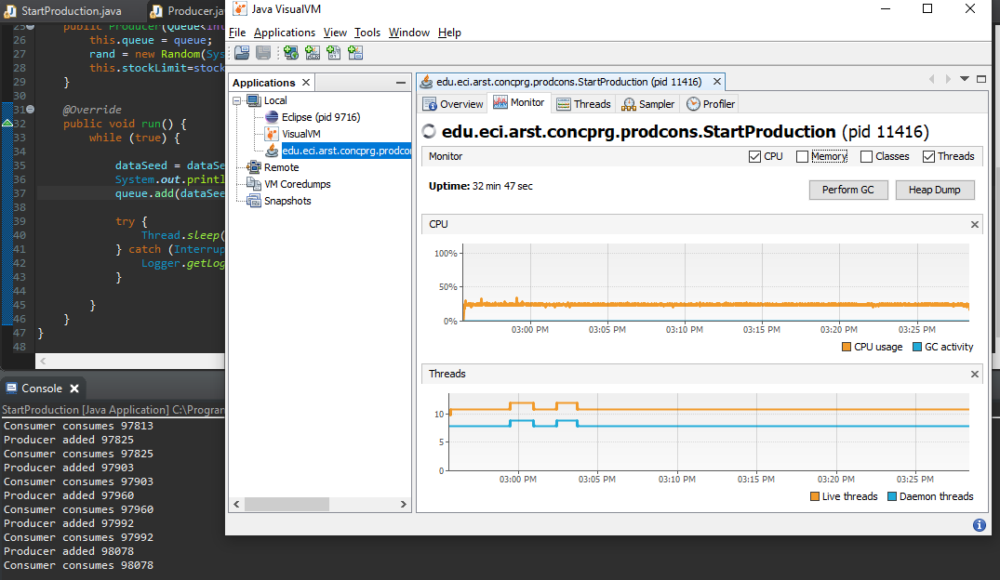
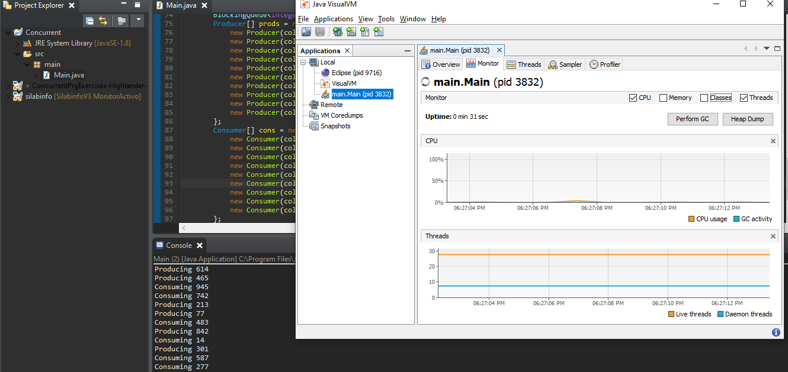
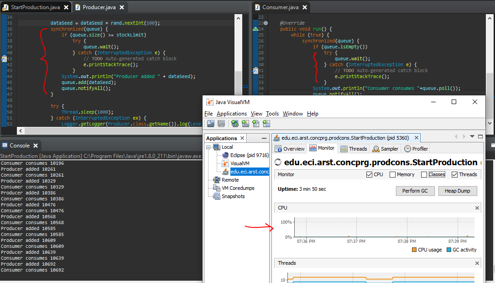
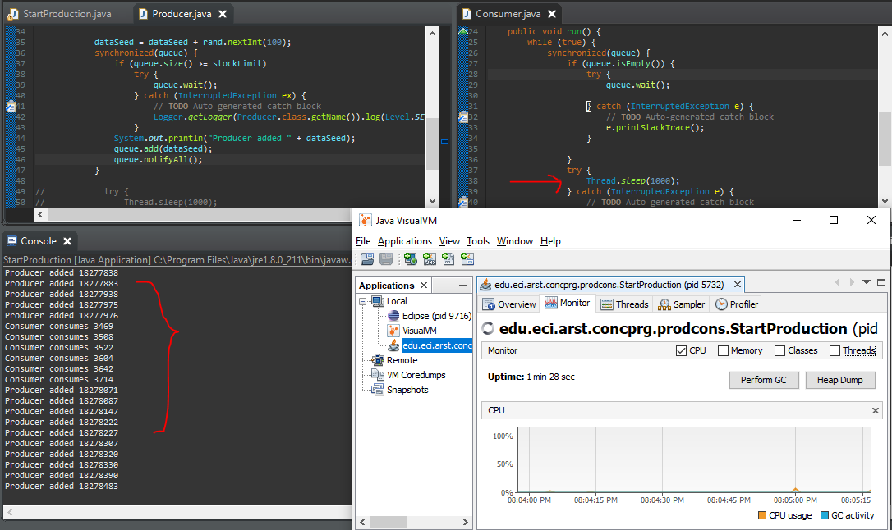
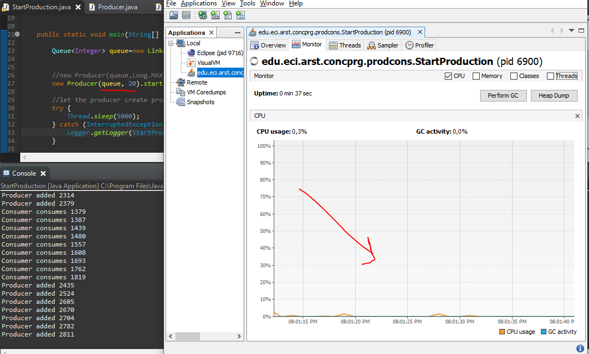

# ARSW - Laboratorio 3

## Laboratorio – Programación concurrente, condiciones de carrera y sincronización de hilos - Caso Inmortales

### Descripción
Este laboratorio tiene como fin que el estudiante conozca y aplique conceptos propios de la programación concurrente, además de estrategias que eviten condiciones de carrera.

### *PARTE I*

Control de hilos con wait/notify. Productor/consumidor.

1. El consumo de CPU que se da durante la ejecución del programa se debe a que el *Consumer* realiza una espera activa mientras la cola esté vacía.
Debido a que el *Producer* tarda 1000 milisegundos en producir un elemento, el CPU le da al hilo del consumidor el procesador muchas veces pero no realiza proceso.
Esto explica el por qué a pesar de que el consumidor consume tan rápido y que hay un solo hilo productor hay gran uso del procesador.

**Comparación con un programa de la misma naturaleza: Productor-Consumidor**

2. Se solucionó usando un `wait()` cuando el consumidor no tuviera elementos para sacar y también cuando el productor no puede ingresar el elemento.
Se utilizó el patrón de *semáforo* para sincronizar los hilos. También se ve que como se eliminó la espera activa, el consumo de CPU disminuyó considerablemente.

3. Se eliminó la línea de código que hacía que el productor esperara para poder agregar un elemento.

* Se observa un aumento en el uso de la CPU debido a que antes era más probable que el hilo consumidor estuviera mucho tiempo inactivo y el hilo productor estuviera esperando.
Como hay un gran límite, el productor queda menos tiempo en espera y utiliza en más ocasiones el CPU.

* En este caso, se dejó un número pequeño de límite (20). De esta manera, es más rpobable que el hilo productor quede en espera, lo que reduce el consumo de CPU

### *PARTE II*

1. 